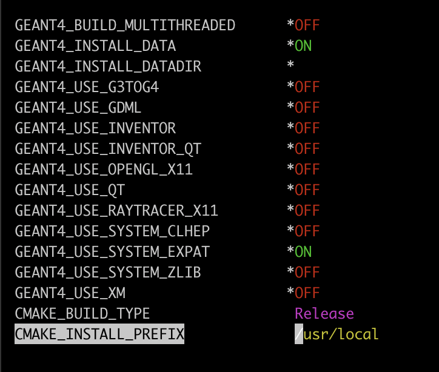
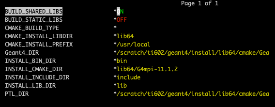
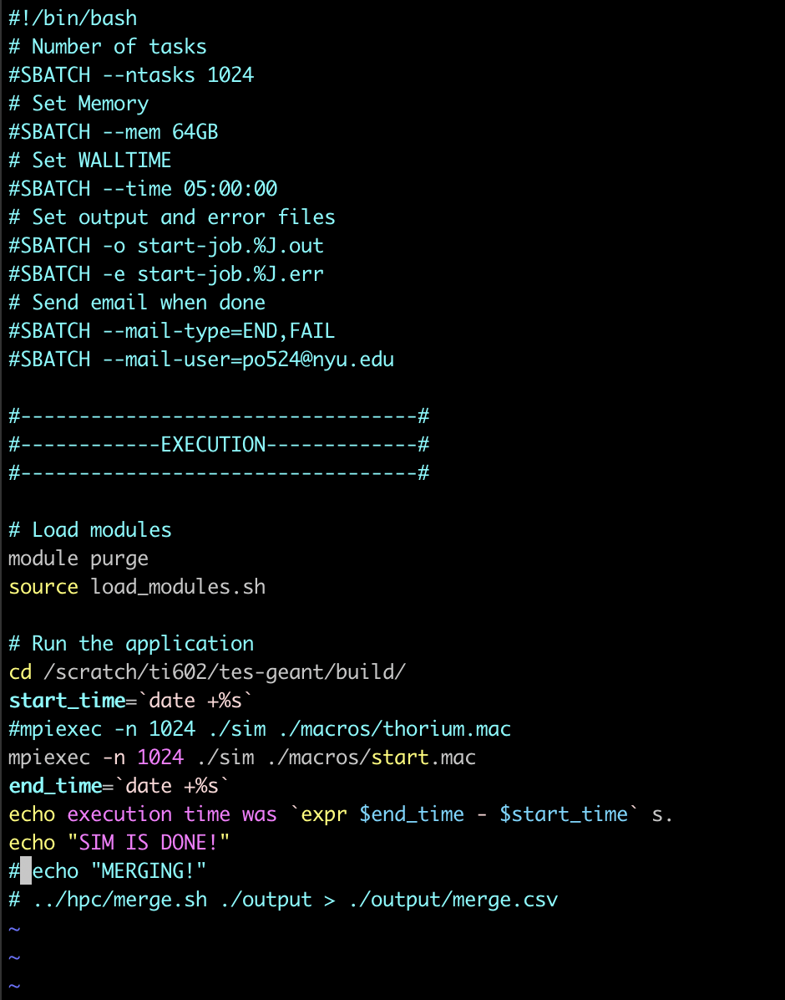

# TES Geant4

[](LICENSE)

## Description

This repo is for building a GEANT4 simulation of a Cryostat with a Transition edge sensor (TES) substrate within it. 

## Table of Contents

- [Installation](#installation)
- [Usage](#usage)
- [Features](#features)
- [Contributing](#contributing)
- [Acknowledgments](#acknowledgments)
- [Contact](#contact)

## Installation

### Geant4 on Jubail HPC

This guide explains how to install Geant4 on NYUAD Jubail high-performance computing (HPC) cluster.

#### Connecting to HPC

```terminal
ssh your_id@jubail.abudhabi.nyu.edu;
cd scratch/your_id;
```

#### Installing xerces-c and for GDML support

Following the [GEANT4 GDML prerequisites](https://geant4-userdoc.web.cern.ch/UsersGuides/InstallationGuide/html/gettingstarted.html) we need to install Xerces-C++ >=3, and build it with netaccessor curl.

##### Xerces-C.

From you geant4 directory:

```terminal
module load gcc cmake mpich expat;
mkdir geant4
wget https://dlcdn.apache.org//xerces/c/3/sources/xerces-c-3.2.4.tar.gz;
tar -xzf xerces-c-3.2.4.tar.gz;
cd xerces-c-3.2.4;
./configure --enable-netaccessor-curl;
mkdir build;
cd build;
ccmake --build ..
```

Change the cmake_install_prefix to /scratch/your_id/geant4/xerces-c-3.2.4/install. Then install. 

```terminal
make install
```

#### Downloading GEANT4

```terminal
cd /scratch/your_id/;
wget https://gitlab.cern.ch/geant4/geant4/-/archive/v11.1.2/geant4-v11.1.2.tar.gz;
tar -xzf geant4-v11.1.2.tar.gz;
```

#### Installing GEANT4

```terminal
mkdir build;
mkdir install;
mv ../geant4-v11.1.2 ./geant4-v11.1.2;
cd build;
ccmake ../geant4-v11.1.2;
```

Enable the gdml option, change the install prefix to /scratch/your_id/geant4/install. Toggle advance mode.
Set the following to these:

```terminal
XercesC_INCLUDE_DIR              /scratch/your_id/geant4/xerces-c-3.2.4/install/include
XercesC_LIBRARY_RELEASE          /scratch/your_id/geant4/xerces-c-3.2.4/install/lib64/libxerces-c.sotqq
```

Your screen should look something like this before you configure:
<!-- {:height="10px" width="10px"} -->


You should press ``c`` to configure. If it prompts you to exit press ``e``. Then configure untill you see ``generate`` option at the bottom of the screen. Generate by pressing ``g``. 

After this you can ``make`` using a separate screen, because the installation may take a while, especially on login nodes.

```terminal
screen
```

Regardles of using screen or not you proceed with:

```terminal
make -j20;
make install;
```

You can detach the screen after you started ``make`` by first pressing ``Ctrl A `` and then ``Ctrl D``. To check the installation you just go back to screen by ``screen`` again.

After your installation is done you need to source GEANT4 by:

```terminal
source /scratch/your_id/geant4/install/bin/geant4.sh
```

#### Installing GEANT4 MPI (Message Passing Interaface)

Iff you have followed the guide you should do the following in order to insall MPI for GEANT4 to use multiprocessing on the HPC
```terminal
cd /scratch/your_ID/geant4;
mkdir g4mpi;
cd /scratch/your_ID/geant4/install/share/Geant4/examples/extended/parallel/MPI/source;
mkdir build;
cd build;
ccmake ..
```



In your ``ccmake`` change your ``CMAKE_INSTALL_PREFIX`` to:

```terminal
/scratch/your_ID/geant4/g4mpi
```

After this set your MPI variable:
```terminal
echo "export G4MPI_DIR=/scratch/your_ID/geant4/g4mpi/lib64/G4mpi-11.1.2" >> /home/your_ID/.bashrc;
source /home/your_ID/.bashrc;
```

Then:
```terminal
make;
make install
```

### tes-geant
```terminal
git clone git@github.com:nyuad-astroparticle/tes-geant.git
```
You will need a working ssh key on git generated on the HPC. For that please follow the official [GitHub guide](https://docs.github.com/en/authentication/connecting-to-github-with-ssh/generating-a-new-ssh-key-and-adding-it-to-the-ssh-agent).

After that you need to cry by doing the following:
```terminal
cd tes-geant;
tar -xzf cry_v1.7.tar.gzcry_v1.7.tar.gz
```


## Usage

After you modify any of the code, from your directory create a ``build`` directory if it does not exist:
```terminal
mkdir build
```
Otherwise remove all of the CMake cash from the ``build`` folder:
```terminal
rm -rf CMakeCache.txt cmake_install.cmake CMakeFiles Makefile;
```

Then make. Use -j flag to denote number of core you want to use in the process. It is not recommened to use all of the cores available.
```terminal
make -j7
```

### Running with mpi

To run on NYUAD Jubail HPC you need to be registered. Please read on the [official website](https://crc-docs.abudhabi.nyu.edu/hpc/hpc.html) how to register an account and submit jobs.

Go to tes-geant/hpc and modify run-start.sh file:
```terminal
cd tes-geant/hpc;
vim run-start.sh
```


Then submit the job by typing:
```terminal
sbatch run-start.sh
```
You can see the output of programm by tailing the output file:
```terminal
tail -f start-job....out
```

To exit, simply press ``Ctrl + C``
To see the status of your job you can use ``sacct`` or ``squeue``. To check the HPC use you can type ``cmap``.

### Pre-run checklist:

- [ ] Are you on a correct branch?
- [ ] Have you pulled all the changes?
- [ ] Have you loaded all modules?
- [ ] Have you sourced GEANT4?
- [ ] Have you ccmade your build directory?
- [ ] Have you made your directory?
- [ ] Have you adjusted macros in your directory?
- [ ] Have you modified run_start.sh?
- [ ] Have you run sbatch?
- [ ] Have you tailed the outptu to verify if it is loading?
- [ ] Have you waited for 2 mins after starting the job to verify that it does not crash in a short time?

## Features

- HPC-enabled multiprocessing for optimized performance on parallel systems.
- Support for various mesh file formats, including gdml.
- Built-in radioactive decay simulation option.
- Toggleable geometry and property settings for flexible customization.
- Integration of low-energy physics.

## Contributing

We welcome contributions to this project! If you find a bug, have a feature request, or want to improve the code, feel free to fork this repository and create your own version.
After you've submitted the pull request, we will review your changes and provide feedback if necessary. Once everything looks good, we'll merge your changes into the main project. 

### Creating Your Own Version

We encourage you to create your own version of this project based on your needs. You are free to modify, extend, or adapt the code in any way you want. There are no restrictions on using this project as a starting point for your own creations.

### Feedback and Support

If you have any questions, feedback, or need assistance, don't hesitate to open an issue on this repository.

Thank you for considering contributing to our project and making it better for everyone.

## Acknowledgments

Tools:
- [CADMesh](https://github.com/christopherpoole/CADMesh)
- [GEANT4](https://geant4.web.cern.ch/)
- [FreeCad](https://www.freecad.org/)
- [Fusion360](https://www.autodesk.com/products/fusion-360/overview?term=1-YEAR&tab=subscription)
- [MeshLab](https://www.meshlab.net/)

Contributors:
- Danish Khan
- Panos Economou
- Tengiz Ibrayev
- Zak Saeed

## Contact

[Panos Economou](https://github.com/PanosEconomou), [Tengiz Ibrayev](https://github.com/F7East)

